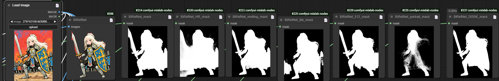
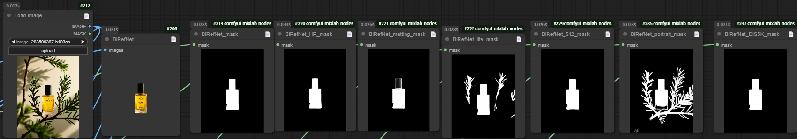
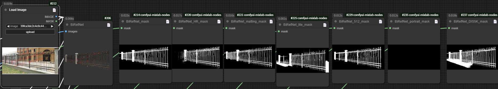
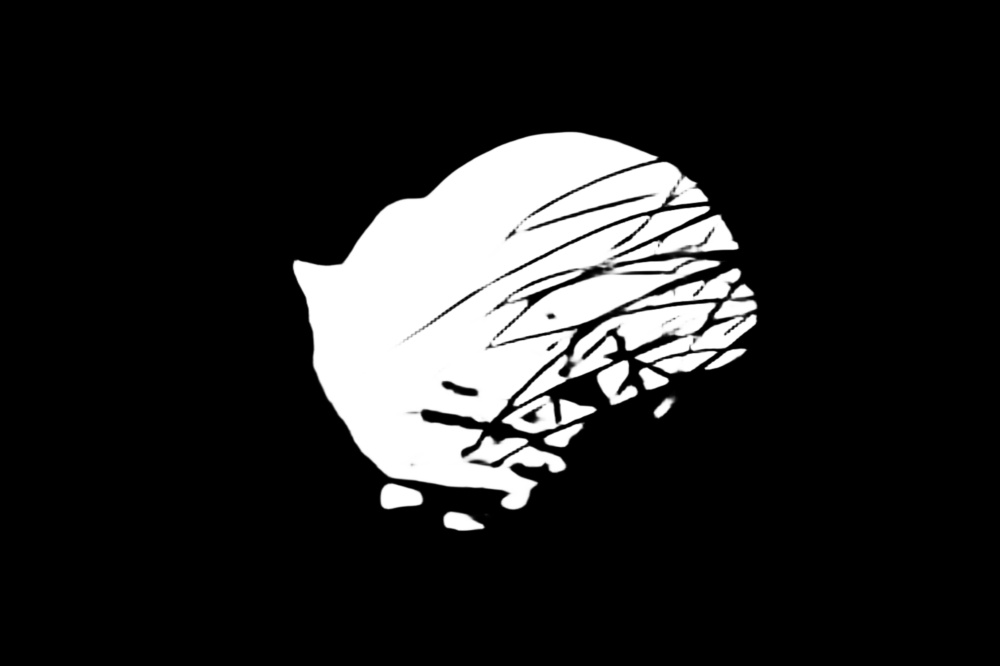
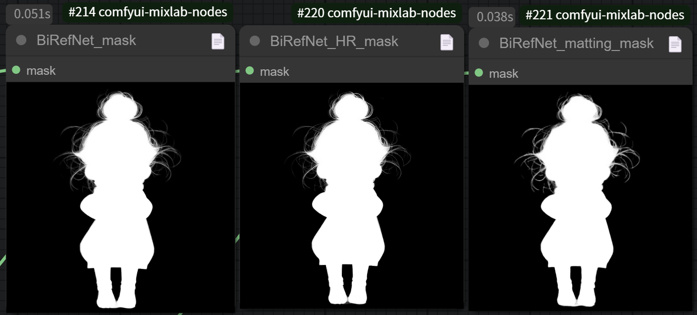
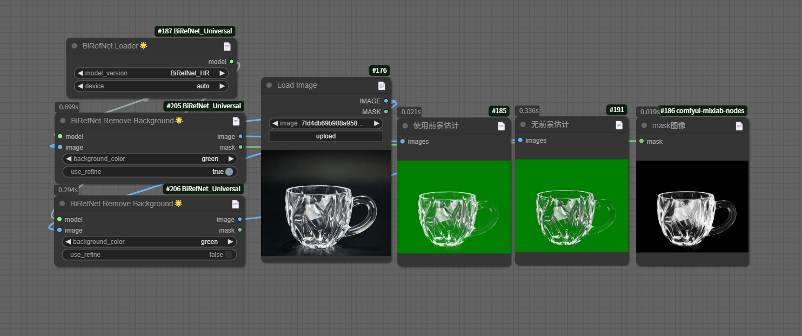

## 简介

提供了一套完整的BiRefNet模型调用解决方案。该项目可调用huggingface上最新的BiRefNet系列模型，方便自动下载、手动下载和调用，支持一键调用各类模型进行抠图处理，方便一键下载模型或手动下载模型。

## 功能

- 🚀 支持全系列BiRefNet模型，包括通用模型、高分辨率模型和轻量级模型等，支持所有BiRefNet的huggingface模型库

- 💫 自动模型管理，支持本地加载与在线下载

  可以直接下载到models\BiRefNet\下，如图所示：

  

  也可以选择运行的时候自动下载

- 🎯 针对不同场景优化的模型选项，自动选择模型推理时的最佳抠图尺寸

  - BiRefNet
    适合通用场景，1024*1024推理，为展示各模型效果，这里给出一些测试案例。

    - 插画人物效果对比，此轮DIS5K结果最优。

      
    - 产品主体抠图效果对比

      
    - 结构较为复杂的主体

      

  - BiRefNet_HR
    适合更高分辨率，2048*2048推理，在高分辨率图像抠图时，由于本身可推理尺寸较大，以及训练时使用了matting类数据集(主要为镂空、透明玻璃、人物发丝等)，所以可以获得更为细致、自然的边缘以及玻璃透光类图像，推荐使用时优先选择。

    - 可缓解边缘锯齿问题，细节抠图更优

      

      

  - BiRefNet-matting
    镂空、透明、发丝类数据专项训练，1024*1024推理，由于推理尺寸较小，因此边缘清晰度不如BiRefNet_HR

    - 发丝清晰度对比

      
      
    - 玻璃杯抠图对比，matting效果较好，前景预估效果也较好

      
      

  - BiRefNet_lite
    轻量级模型，1024*1024推理

  - BiRefNet_lite-2K
    轻量级模型，2560*1440推理

  - BiRefNet_512x512
    对于小图效果更好，512*512推理

  - BiRefNet-portrait
    针对人像类抠图任务，1024*1024推理

  - 其他：为在各个数据集上训练的分割模型，1024*1024推理，此类模型中的抠图效果更偏向于硬分割，即边缘过渡感较差，若图像对边缘要求较高，需要另外加matting类模型做后处理。

- 🌟 对抠图结果进行前景颜色预估，使得有透明度的像素部分更贴近真实前景颜色

  
  
  

## 感谢

感谢BiRefNet仓库的所有作者开源的代码和模型 [ZhengPeng7/BiRefNet](https://github.com/zhengpeng7/birefnet)
模型库主页：https://huggingface.co/ZhengPeng7